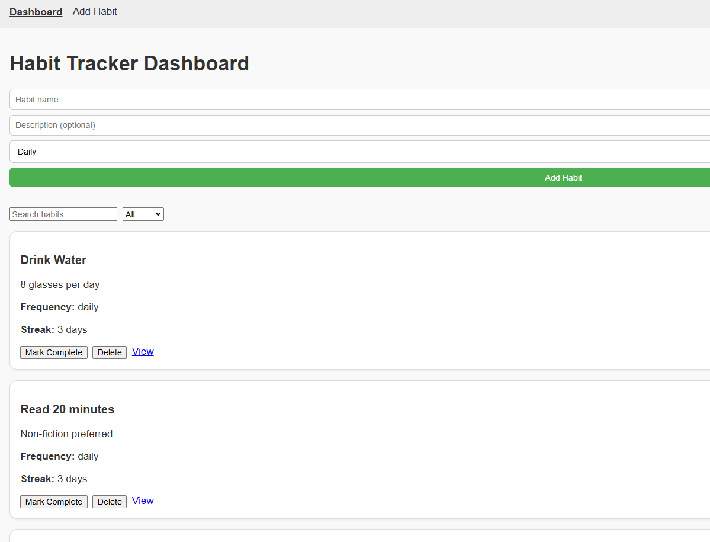

# Habit Tracker
Includes:
- Dashboard (list + mark complete)
- Add Habit form (inline on Dashboard + dedicated /add page)
- NavBar with routes
- Habit Detail Page (edit)
- Delete habits
- Search & Filter
- db.json seed for json-server

# Habit Tracker
A modern, single-page web application designed to help individuals build, track, and maintain positive daily habits.  
With an intuitive dashboard, habit management tools, and progress tracking, Habit Tracker makes it simple to stay accountable and motivated.

---

## Features
- Dashboard – list habits + mark them as complete  
- Add Habit – inline form on Dashboard + dedicated `/add` page  
- Habit Detail Page – view & edit existing habits  
- Delete Habits – remove habits you no longer need  
- Search & Filter – quickly find specific habits  
- NavBar with Routes – navigate across pages easily  
- JSON Server (db.json) – seeded API for testing & persistence  

---

## Setup Instructions

### Prerequisites
- Node.js & npm installed
- Vite (for React dev server)
- json-server

### Steps
1. Clone this repo  
   ```bash
   git clone <https://github.com/GidionOndari/Habit-Tracker-Project>
   cd habit-tracker
   ```

2. Install dependencies  
   ```bash
   npm install
   ```

3. Start the mock API (json-server)  
   From the project root (where `db.json` lives):  
   ```bash
   npx json-server --watch db.json --port 4000
   ```

4. Run the React app  
   ```bash
   npm run dev
   ```

---

## API Notes
- Base URL: `http://localhost:4000/habits`
- Default seed data lives in `db.json`
- You can extend the model with extra fields (e.g., `goal`, `category`)
- Dashboard prevents marking the same habit "complete" more than once per day

---

## Screenshots

---

## Team Members
- Gidion Ondari
- Sharon Gacheru
- Edwin Kemari  

---
